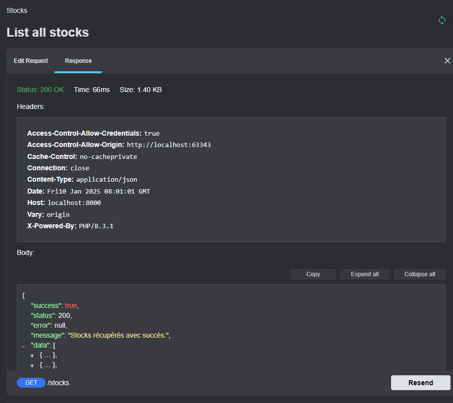

# Stock Management API

[](LICENSE)

Une API de gestion de stock développée avec Laravel 11. Cette API permet de gérer les produits, les mouvements de stock, et de calculer les jours en stock pour un produit donné.

---

## Fonctionnalités

- **Gestion des produits** : Ajouter, modifier, supprimer et lister les produits.
- **Mouvements de stock** : Suivre les entrées et sorties de stock.
- **Calcul des jours en stock** : Calculer le nombre de jours de stock restants pour un produit.
- **Documentation Swagger** : Documentation interactive de l'API avec Swagger UI.

---

## Prérequis

- PHP 8.2 ou supérieur
- Composer
- MySQL ou autre base de données compatible
- Laravel 11

---

## Installation

1. **Cloner le dépôt**

   ```bash
   git clone https://github.com/votre-utilisateur/votre-repo.git
   cd votre-repo

2. **Installer les dépendances**

   ```bash
   composer install
   
3. **Configurer l'environnement**

   ```bash
   cp .env.example .env
   Modifiez les variables suivantes dans le fichier .env :
   DB_CONNECTION=mysql
   DB_HOST=127.0.0.1
   DB_PORT=3306
   DB_DATABASE=nom_de_la_base_de_donnees
   DB_USERNAME=utilisateur
   DB_PASSWORD=mot_de_passe
   
4. **Générer la clé d'application**

   ```bash
   php artisan key:generate
   
5. **Exécuter les migrations**

   ```bash
   php artisan migrate
   
6. **Générer la documentation Swagger**

   ```bash
   php artisan l5-swagger:generate
   
7. **Démarrer le serveur**

   ```bash
   php artisan serve

## Utilisation

#### Accéder à la documentation Swagger

   La documentation interactive de l'API est disponible à l'adresse suivante :
   ```bash
   http://localhost:8000/api/documentation
  
- **Endpoints disponibles** :
  - GET /api/v1/stocks : Lister tous les produits en stock.
  - POST /api/v1/stocks : Ajouter un nouveau produit en stock.
  - GET /api/v1/stocks/{id} : Obtenir les détails d'un produit.
  - PUT /api/v1/stocks/{id} : Mettre à jour un produit.
  - DELETE /api/v1/stocks/{id} : Supprimer un produit.
  - GET /api/v1/stocks/{productCode}/days-in-stock : Calculer les jours en stock pour un produit.
  - GET /api/v1/stocks/{productCode}/movements : Obtenir les mouvements de stock pour un produit.


